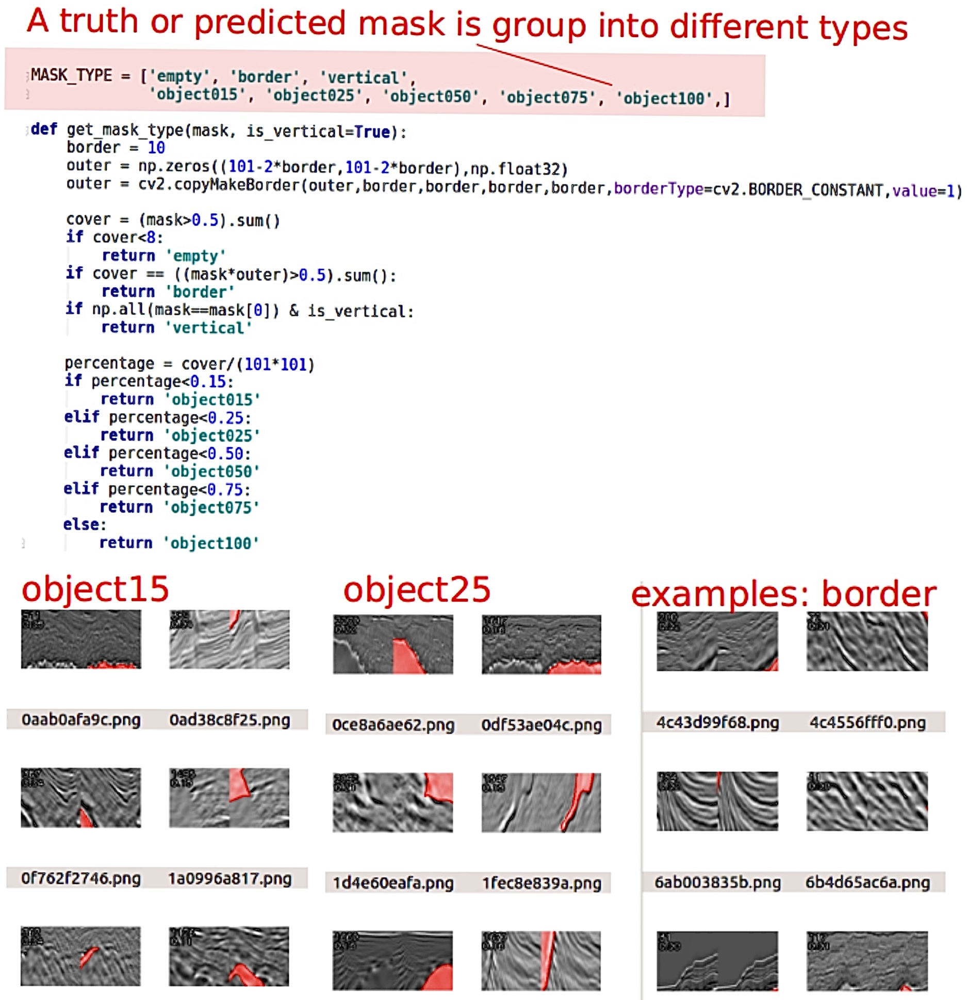
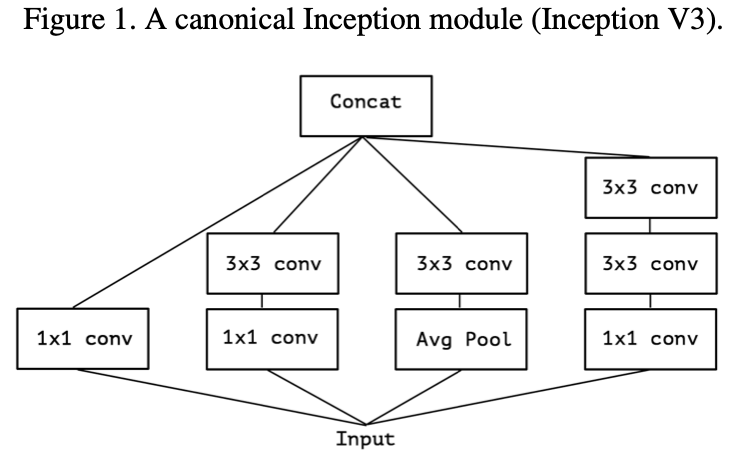

# Salt-Image-Segmentation
- automatically and accurately identifies if a subsurface target is salt or not.

- Based on the dataset provided by a geoscience data company [seismic image](https://www.kaggle.com/competitions/tgs-salt-identification-challenge/data), 
which is a set of images are 101 x 101 pixels and each pixel is classified as either salt or sediment.

## Experiment I did:
### Experiment 1: CNN segmentation identifying salt 

- Files: [data_cleaning](https://github.com/LiuYuqing14/Salt-Image-Segmentation/blob/main/data_cleaning.py), [model_construction](https://github.com/LiuYuqing14/Salt-Image-Segmentation/blob/main/model_construct.py), and [data_evaluation](https://github.com/LiuYuqing14/Salt-Image-Segmentation/blob/main/model_evaluation.py)
- CNN model parameters:
  - optimizer = 'adam', Relu activation function
  - ResNet architecture and intersection-over-union (IoU) score evaluation
- Result:
  - 0.803 Public LB (0.812 Private LB)
  - 
  - 
- Reflection:
  - The incorrect labeling appears since there are limited training set and imbalanced set. We can not simply dividing set according to the percentage like the image below. The boundaries has very little percentage, and I infer there are catastrophic cancellation caused by computer during computation.
  - 
  
### Experiment 2: Which Encoder-Decoder Architecture workes best?

- files: [encoder_Xception](https://github.com/LiuYuqing14/Salt-Image-Segmentation/blob/main/encoder_Xception.py), [different_architecture_decoder](https://github.com/LiuYuqing14/Salt-Image-Segmentation/blob/main/reordering_decoder.py)
- Model 1 (inspired by [Mr.ybabakhin's work](https://github.com/ybabakhin/kaggle_salt_bes_phalanx/tree/master))
  - input 101 -> pad to 512
  - Encoder:ResNet34
  - Decoder: conv3x3 + BN, Upsampling, scSE
- Model 2
  - input 101 -> resize to 512
  - Encoder: ResNet34
  - Decoder: conv3x3 + BN, Upsampling, scSE
  - (PS: I haven't run the entire models above because of time and technic limitation, but I tested partical of encoder part and combine with the conclusion from Mr.ybabakhin.)
- Model 3 (inspired by [this work](https://www.kaggle.com/code/meaninglesslives/getting-0-87-on-private-lb-using-kaggle-kernel/notebook))
  - This model is similar to model1 with same residual block and convolution block, but used Xception as the encoder block, the decoder block is only changed with activation function, but also extended the target into 160(not 101 as original).
- Result:
  - The Xception encoder much better than all the models I have trained. Learning from the paper *Xception: Deep Learning with Depthwise Separable Convolutions*，the additional inception modules helps a lot. It reduces dimension, which is via a set of 1x1 convolutions, mapping the input data into 3 or 4. However, I still have questions on this strategy since how does correlations can be mapped completely separately, and it indeed leading a simpler computation, but how precise it can be through lower dim? I will investigate more on that...
  - 

### Experiment 3: Appling pseudo labels to trainig set 

- files: [Pseudo_Label](https://github.com/LiuYuqing14/Salt-Image-Segmentation/blob/main/Pseudo_Labels.ipynb)
- Inspired by paper *Iterative ensemble pseudo-labeling for convolutional neural networks*
- Pseudo Labels is a kind of Semi-Supervised Learning method, with real labels and pseudo labels to train the model. I thought it works since I have mensioned there are limited dataset and the process of training will bring incorrect labels, pseudo labels will bring new samples, which works like reinforcing the model..?

## Experiment I plan to do later:
- Stochastic Weight Averaging (SWA) It has been shown in recent paper that SWA finds much broader optima than SGD. Using SWA in the customized callbacks funtions probaly works.
- I saw there are people shared their ideas, which mensioned to use Normalized Gradient optimizer on each layer of the mini-batch stochastic gradient.
